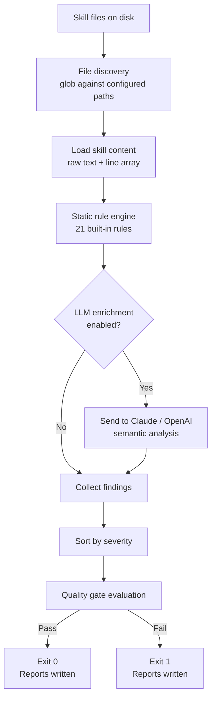
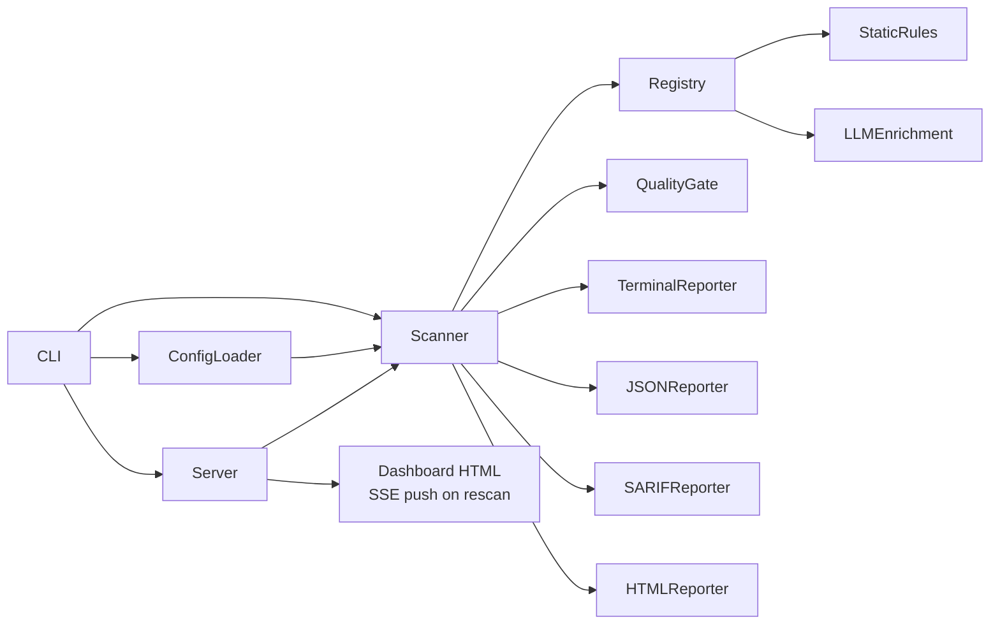
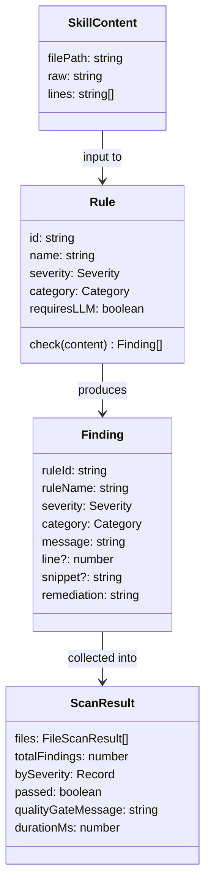
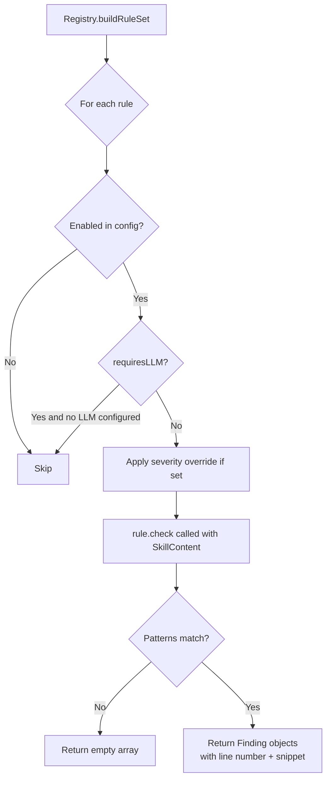
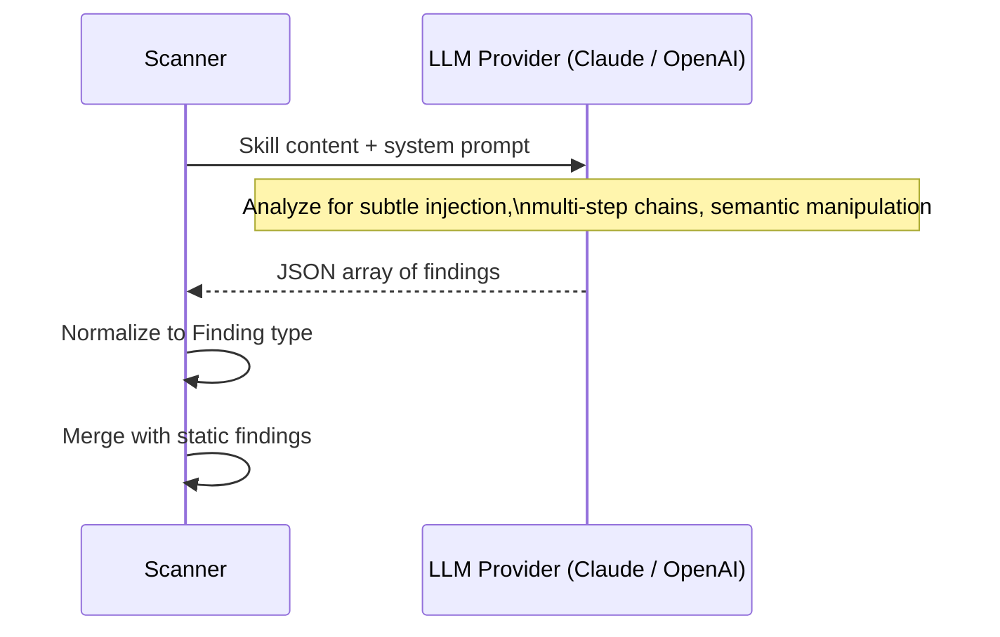
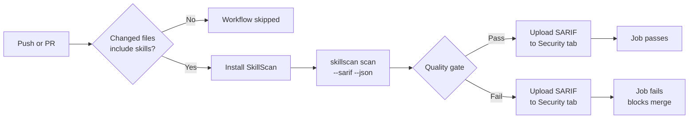
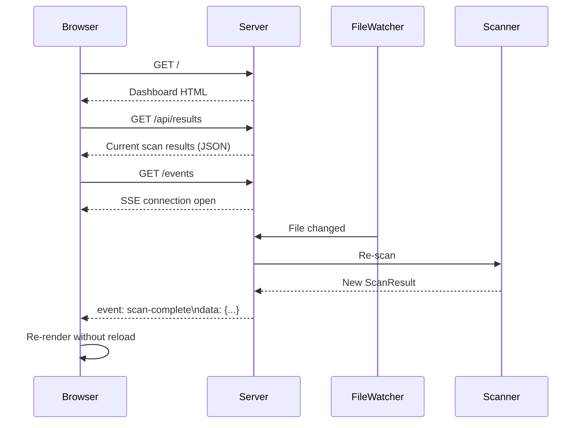

# SkillScan

**v0.1 Early Access**

SkillScan is a security scanner for Claude Code skill files. It works like SonarQube: a rule engine evaluates your skill files, produces categorized findings with severity levels, enforces a configurable quality gate, and integrates into CI so insecure skills never make it into production.

Skill files (`.md`, `.yml`, `.txt`) are treated as trusted configuration by AI coding agents. A malicious or compromised skill can silently hijack the agent, exfiltrate secrets, run destructive commands, or impersonate system authority. SkillScan makes skill security auditable and automatable.

---

## Table of Contents

- [How It Works](#how-it-works)
- [Architecture](#architecture)
- [Rule Engine](#rule-engine)
- [Quick Start](#quick-start)
- [Commands](#commands)
- [Configuration](#configuration)
- [Rule Catalog](#rule-catalog)
- [LLM Enrichment](#llm-enrichment)
- [CI Integration](#ci-integration)
- [Web Dashboard](#web-dashboard)
- [License](#license)

---

## How It Works

SkillScan runs in two stages. The first stage is static analysis: pattern matching against a catalog of named rules. This requires no API keys and runs in milliseconds. The second stage is optional LLM enrichment: the skill content is sent to Claude or OpenAI for semantic analysis, catching subtle manipulation that static patterns miss. Both stages produce the same output format, and both feed into the same quality gate.



---

## Architecture

The project is structured as a pipeline with clear boundaries between discovery, evaluation, reporting, and the optional serve mode.

```
skillscan/
  src/
    cli/          Entry point. Parses arguments, loads config, wires pipeline.
    config/       Loads and validates skillscan.yml using Zod.
    core/
      scanner     Orchestrates file discovery, rule execution, and LLM calls.
      quality-gate Evaluates pass/fail against configured thresholds.
    rules/
      registry    Builds the active rule set from all rules + config overrides.
      static/     Pattern-based rules. No external dependencies.
      llm/        LLM-backed rules. Requires API key.
    reporters/    One module per output format: terminal, JSON, SARIF, HTML.
    server/       HTTP server and SSE for the web dashboard (serve command).
  test/
    fixtures/     Sample skill files used for manual and CI testing.
```

### Data flow between modules



### Key types



---

## Rule Engine

Each rule is a TypeScript module that exports a `Rule` object. The `check` method receives a `SkillContent` object and returns zero or more `Finding` objects.



Rules are organized into six categories:

| Category | Description |
|---|---|
| injection | Instructions that attempt to override or hijack the agent's context |
| exfiltration | References to secrets, credentials, or instructions to transmit data externally |
| tool-abuse | Instructions to run destructive, irreversible, or hook-bypassing commands |
| obfuscation | Hidden or encoded content: base64 payloads, HTML comments, zero-width characters |
| social-engineering | Urgency manipulation, fake authority claims, instructions to hide actions |
| permission-escalation | Attempts to claim or grant blanket tool access or modify agent settings |

Severity levels follow the SonarQube model: `info`, `minor`, `major`, `critical`, `blocker`. The quality gate fails when the scan produces findings at or above the configured threshold.

---

## Quick Start

Run a one-off scan with no install:

```bash
npx tsx src/cli/index.ts scan ./skills
```

Or install globally:

```bash
npm install -g skillscan
skillscan scan ./skills
```

Initialize a config file:

```bash
skillscan init
```

Launch the web dashboard with live file watching:

```bash
skillscan serve
```

---

## Commands

### scan

Scans skill files and exits with code 0 (pass) or 1 (fail).

```
skillscan scan [paths...] [options]

Options:
  -c, --config <path>      Path to skillscan.yml (default: auto-detect)
  --no-terminal            Suppress terminal output
  --json                   Write JSON report to output dir
  --sarif                  Write SARIF report to output dir
  --html                   Write HTML report to output dir
  --output-dir <dir>       Directory for report files (default: .skillscan)
  --fail-on <severity>     Severity threshold for non-zero exit (default: critical)
  --llm <provider>         Enable LLM enrichment: claude or openai
  --model <model>          LLM model to use
```

### serve

Starts the web dashboard at `http://localhost:7117`. Watches configured paths and rescans automatically when files change.

```
skillscan serve [paths...] [options]

Options:
  -c, --config <path>      Path to skillscan.yml
  -p, --port <number>      Port to listen on (default: 7117)
  --llm <provider>         Enable LLM enrichment: claude or openai
  --model <model>          LLM model to use
```

### rules

Lists all available rules.

```
skillscan rules [--json]
```

### init

Creates a `skillscan.yml` in the current directory with sensible defaults.

```
skillscan init
```

---

## Configuration

Place a `skillscan.yml` in the root of your repository. SkillScan will find it automatically.

```yaml
scan:
  paths:
    - .claude/skills   # Claude Code skills directory
    - skills           # project-level skills
    - .claude          # catch-all for CLAUDE.md and settings

quality_gate:
  fail_on: critical    # fail if any finding is critical or higher
  max_major: 5         # also fail if more than 5 major findings

rules:
  SKILL-023:           # override a rule's severity
    severity: blocker
  SKILL-031:           # disable a rule entirely
    enabled: false

# Optional. Remove this block if you are not using LLM enrichment.
llm:
  provider: claude
  model: claude-sonnet-5

output:
  formats:
    - terminal
    - sarif
    - html
  output_dir: .skillscan
```

### Quality gate reference

| Field | Type | Default | Description |
|---|---|---|---|
| `fail_on` | severity | `critical` | Minimum severity that triggers a failing exit code |
| `max_minor` | number | none | Fail if minor count exceeds this |
| `max_major` | number | none | Fail if major count exceeds this |
| `max_critical` | number | none | Fail if critical count exceeds this |

---

## Rule Catalog

### Injection

| ID | Name | Default Severity |
|---|---|---|
| SKILL-001 | Ignore Previous Instructions | blocker |
| SKILL-002 | Role Reassignment | blocker |
| SKILL-003 | Safety Bypass Instruction | blocker |
| SKILL-004 | Hidden Delimiter Injection | critical |

### Exfiltration

| ID | Name | Default Severity |
|---|---|---|
| SKILL-010 | Sensitive File Path Reference | critical |
| SKILL-011 | Network Exfiltration Pattern | blocker |
| SKILL-012 | Secret Read Instruction | critical |

### Tool Abuse

| ID | Name | Default Severity |
|---|---|---|
| SKILL-020 | Destructive Command | blocker |
| SKILL-021 | Force Push Instruction | critical |
| SKILL-022 | Hard Reset Instruction | critical |
| SKILL-023 | Hook Skip Instruction | major |
| SKILL-024 | Privilege Escalation via sudo | critical |

### Obfuscation

| ID | Name | Default Severity |
|---|---|---|
| SKILL-030 | Base64 Encoded Payload | critical |
| SKILL-031 | HTML Comment Injection | major |
| SKILL-032 | Unicode Homoglyph or Zero-Width Character | critical |

### Social Engineering

| ID | Name | Default Severity |
|---|---|---|
| SKILL-040 | Urgency Manipulation | major |
| SKILL-041 | Authority Impersonation | blocker |
| SKILL-042 | Confidentiality Instruction | critical |

### Permission Escalation

| ID | Name | Default Severity |
|---|---|---|
| SKILL-050 | Blanket Tool Permission Request | critical |
| SKILL-051 | Self-Approval Instruction | blocker |
| SKILL-052 | Settings Manipulation | critical |

---

## LLM Enrichment

When configured, SkillScan sends each skill file to an LLM for semantic analysis after the static rules run. The LLM is prompted to look for subtle manipulation that pattern matching misses: multi-step attack chains, ambiguous phrasing that could be exploited, and context-dependent social engineering.

LLM findings use the same `Finding` type and appear in all report formats alongside static findings.



Set up enrichment with environment variables:

```bash
# For Claude
export ANTHROPIC_API_KEY=your_key
skillscan scan --llm claude

# For OpenAI
export OPENAI_API_KEY=your_key
skillscan scan --llm openai --model gpt-4o
```

Or configure it in `skillscan.yml`:

```yaml
llm:
  provider: claude
  model: claude-sonnet-5
```

---

## CI Integration

SkillScan ships with a GitHub Actions workflow at `.github/workflows/skillscan.yml`. It triggers on pushes and pull requests that touch skill files, runs the scan, and uploads the SARIF report to the repository's Security tab.



The workflow requires one permission: `security-events: write` for SARIF upload. No secrets are required unless you enable LLM enrichment, in which case add `ANTHROPIC_API_KEY` or `OPENAI_API_KEY` to your repository secrets.

To use the workflow in your own repository, copy `.github/workflows/skillscan.yml` and adjust the `paths` trigger to match where your skill files live.

---

## Web Dashboard

`skillscan serve` starts a local web server at `http://localhost:7117`. It runs an initial scan on startup, then watches the configured paths and rescans automatically when files change.

The dashboard communicates via Server-Sent Events. When a file changes, the server rescans and pushes the new results to all open browser tabs without a page reload.



Features:
- Filter findings by severity, category, or free-text search
- File tree in the sidebar showing per-file finding counts
- Expandable finding cards with snippet, message, and remediation
- Rules Catalog tab listing all 21 rules
- Rescan button for manual trigger
- Light and dark mode

---

## License

SkillScan Source Available License 1.0. Free to use including commercially. You may not offer it as a hosted or managed service, and you may not sell or repackage it as a product. See [LICENSE](LICENSE) for the full terms.
